# The flat in Montmartre
## Videos 
- Getting in - <a href="https://youtu.be/UgWd0wF6wAc">Video</a>
- Short walkthrough - <a href="https://youtube.com/shorts/6mJ3P33e6As?feature=share">Video</a>
- Long walkthrough - <a href="https://youtu.be/eYzcQZDt4AE">Video</a>

## Arrival
- See "Getting in" video - door code 2x at the top (or chip), keysafe at the bottom, key is annoying
- Turn up heaters if needed 

**ONLY** if instructed:
- Washing machine water on in bathroom (counterclockwise)
- Hot water on (fuse box opposite front door)
- Water main tap on (under kitchen sink)
- Dishwasher water on (under kitchen sink)

## Departure
- All rubbish & perishables out 
- All windows closed except kitchen window slightly ajar (1 finger)
- All inner doors open
- Lock window handles, close all curtains
- 2xfans plugged in, timers synched
- Fridge off and door open  (unless told otherwise)
- Heating off x3 (unless told otherwise)

**ONLY** if instructed:
- Washing machine water off in bathroom (clockwise)
- Hot water off (fuse box opposite front door)
- Water main tap off (under kitchen sink)
- Dishwasher water off (under kitchen sink)

## INSIDE
- Wifi password - QR code next to entrance door, deroom door, dining room router  
- Air - see long walkthrough video about 2x fans with timers

### Entrance
- Dont lock yourself out! We tend to put the key on the floor next to the door inside - store Koladés number!
- Curtain in front of door inside against the cold
- Fuse box opposite front door, potentially turn on hot water

### Kitchen 
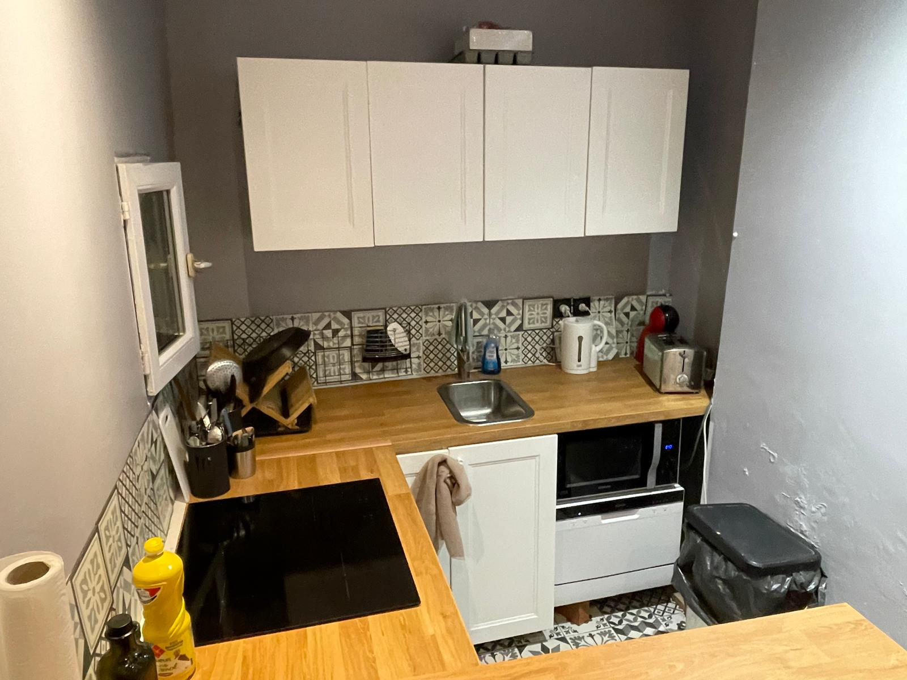

- Dishwasher: Ensure to use "3 in 1" tab as there is no salt container. Always keep the rinsing liquid topped up "liquide the rincage"
- Window: The window opens up on a 7-floor inner aeartion column = good air. Always leave this window a little bit ajar
- Microwave: If the power strip was switched off and micorwave is blinking "12:00", press start button 3 times. See long video for more
- Toaster: See long video for more, press blue button to interrupt/pop up
- Rubbish: Upstairs on level 0 to the right as you exit the elevator, then through the door, right left left. Yellow lid is recyclables. Green lid is the rest. Glass outside opposite front door.
- Additional cleaning supplies under the sink
- Water main tap under the sink. Water to Dishwasher under the sink, usually on unless labelled

### WC
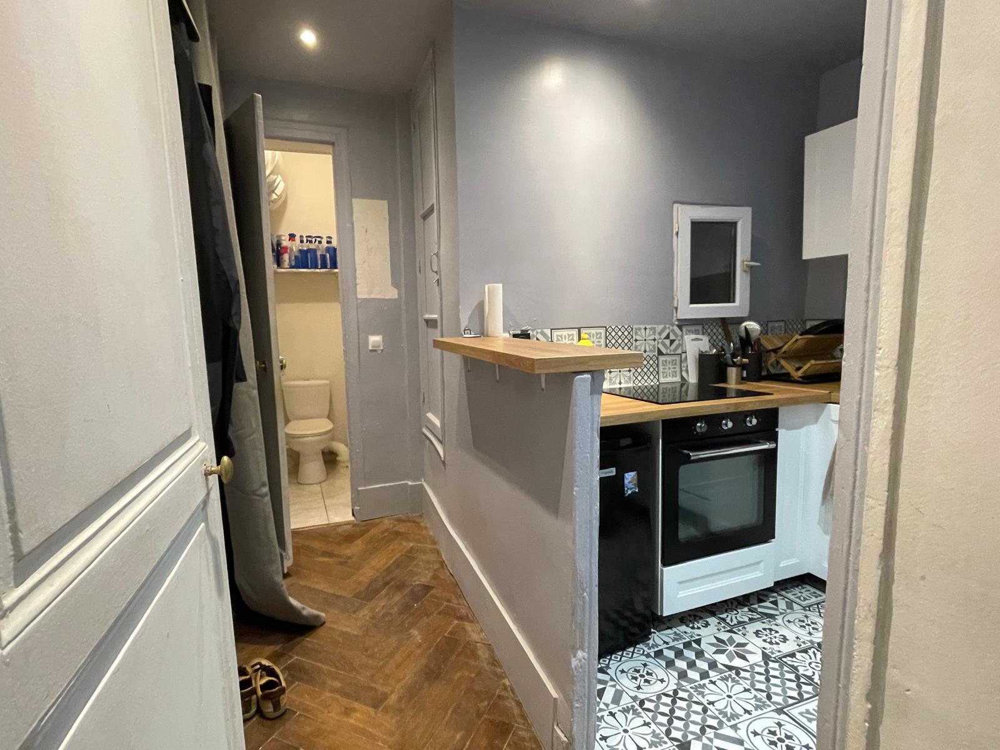

- Open the tap slowly, the water pressure is high and the sink is tiny.
- All cleaning tools should be in the cupboard : Vacum, broom, mop, bucket.
- Any cleaning supplies not here will be under the kitchen sink. 
- There is an aeration vent in the cupboard leading to the outside. please leave the cupboard door ajar when you leave

### Dining Room
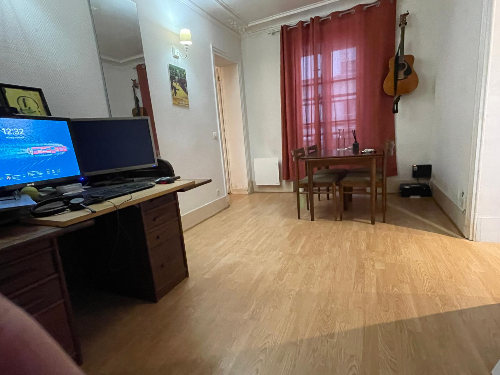

- Table extends
- Desk has a dell docking station
- Tools & materials in the corner: Ignore (unless you wish to do some DIY!)
- Petrol Heating: video TBD
- Fabric-covered wall: The first rule of East wall is that we don't talk about East wall

### Living room
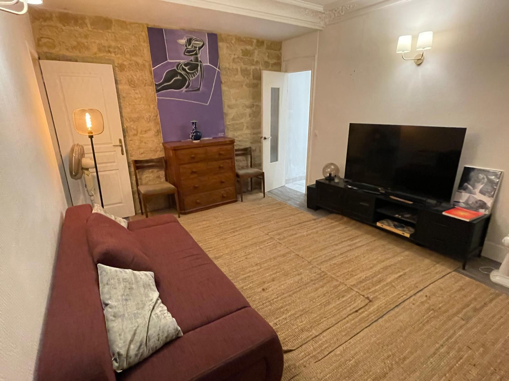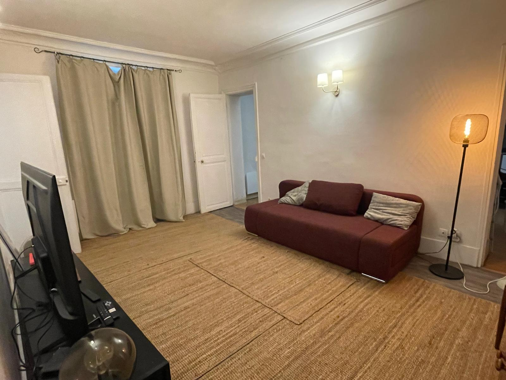

- Couch folds out to 160 bed 
- Additional mattress
- Bedding & towels in the chest of drawers
- TV & soundbar: You'll figure it out if you want it badly enough
- Electric heating: Set to basic 20-21-22
  
### Bedroom

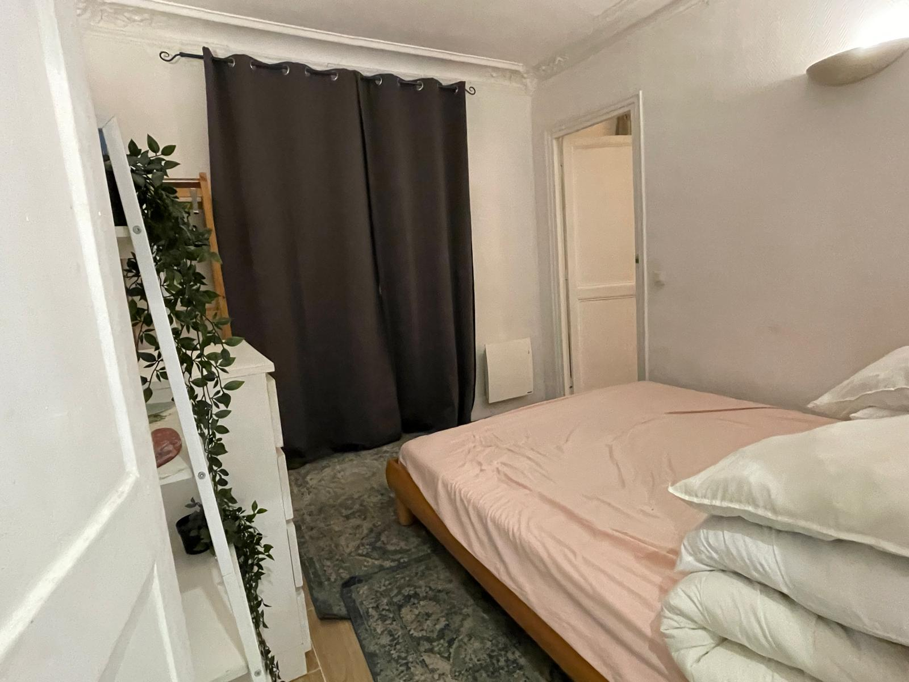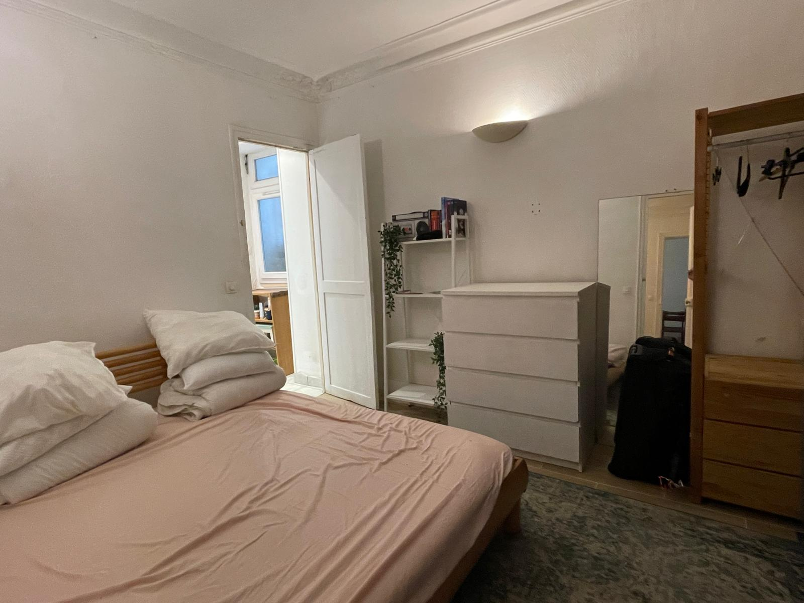

- Leave both doors open when not sleeping

### Bathroom

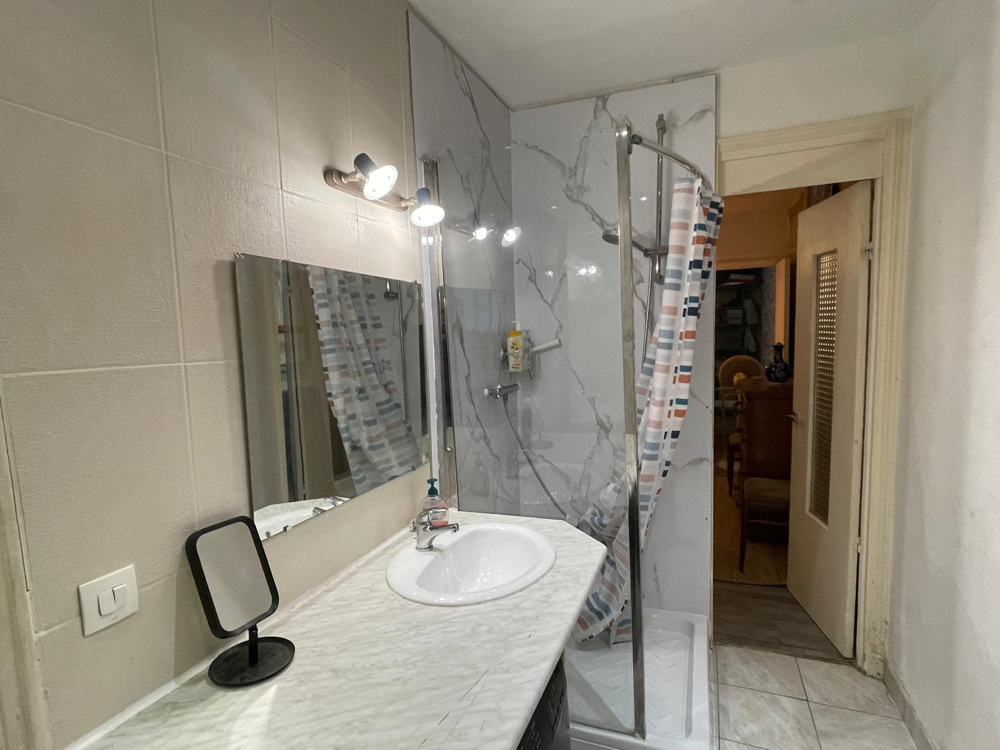
  
- Shower curtain - see <a href="https://youtube.com/shorts/6mJ3P33e6As?feature=share">short</a> and <a href="https://youtu.be/eYzcQZDt4AE">long</a> video
- Squeegee after shower if you are feeling generous
- Washing machine: Note there is a tap underneath for water (usually on unless labled). the eco-40 water, programs, stuff
- <a href="https://maps.app.goo.gl/5JVKbJEFCxnwd2DT8">Laundromat</a> diagonally opposite has an 8 minute dryer program that kicks ass 

## OUTSIDE
### Bakeries
- <a href="https://maps.app.goo.gl/dwKWFyRkyNgDro3L8">"Au levain d'antan"</a> Literally across the street, 2 minutes there and back from the dining table  - closed evenings & weekends
- <a href="https://maps.app.goo.gl/VZDZRajVvA6nuXpLA">"Alexine"</a> Up the road, often a queue, has bread later in the evening than previous, better croissants  worth the walk  
- <a href="https://maps.app.goo.gl/dwKWFyRkyNgDro3L8">"Pain Pain"</a> next door if the others are closed. Pro tip: If you are only getting baguette, you can skip the queuen by going in the left hand door. SOmewhat industrial.
- <a href="https://maps.app.goo.gl/yAX6bmhcsxe8NKURA">"Les copains"</a>: Across the street, the pastries look amazing however are overprived and oversugared HOWEVER you can try the single (!) espresso for €2. Single only - it is absolute rocket fuel.
-   
### Groceries
- <a href="https://maps.app.goo.gl/UbnZcjmJf6QhYuhZA">"Intermarché Express"</a>: well stocked, convenient, unique layout  AND you don't have to walk down & up the hill
- <a href="https://maps.app.goo.gl/UbnZcjmJf6QhYuhZA">Carrefour</a>: slightly larger than above 
- <a href="https://maps.app.goo.gl/2hcecM8zcEseJqnF8">"Paris Market" minimart</a>: if you need a beer and an apple at 3:30 a.m. and only want to walk 53 meters  
- <a href="https://maps.app.goo.gl/Y4c4xZXNeXFHqfqm9">"Boucherie Jacky Gaudin"</a>: an acceptable butcher, not many left. Please let us know if you find other / better 

### Shops 
- 2nd hand clothes <a href="https://maps.app.goo.gl/yPLXWQbvZ2ZxjhnZ8">"Guerisol"</a>, <a href="https://maps.app.goo.gl/wMbdwdfpasJgc1Af8">"Guerisol 2"</a>, <a href="https://maps.app.goo.gl/gdA2KeU7WfoHw5pS8">"Emmaüs"</a>
- <a href="https://maps.app.goo.gl/SeRewx663sQw2dZ98">"Castorama"</a>: DIY store
- <a href="https://maps.app.goo.gl/4xDPLKPiXCqieDPQA">"Gifi"</a>: Cheap home goods
- <a href="https://maps.app.goo.gl/kNX1KdyeowXzZcKD6">"St. Pierre"</a>: THE O.G. fabric store. Lots of wannabes near there.
- <a href="https://maps.app.goo.gl/skAhJjACWREDsmpP7 Au Kilo">"Bijoux au poids"</a>: Silver jewelry by weight
- <a href="https://www.lagrandeepicerie.com/fr">La Grande Épicerie de Paris"</a>: The final boss of food stores.

### Bars & Restaurants
- <a href="https://maps.app.goo.gl/CFdZf9jUvELVU4e19">"Le petit Café de Montmartre"</a>: Danielle the 80+ year old owner is one of last ones to remember Jack 
- <a href="https://maps.app.goo.gl/rioQCCRCfmXstcP59">"Chez Clint"</a>: Where we held Jack's wake
- <a href="https://maps.app.goo.gl/eg4Nc2NNFnGvt5JL9">"La Boîte aux Lettres"</a>: Good restaurant, very solid price/performance. Reservation recommended
- <a href="https://lacouveemontmartre.com/">"La Couvée"</a>: recommended by Kicki & Uli, French not cheap 
- <a href="https://maps.app.goo.gl/Y37Lj1KxFNiwD3Y69">"Chez Celiane"</a>: Chinese takeout, fun buying 2-3 different individual items for a Euro each. Samosas good, the chicken spring roll aint great, vegetable better, have not tried the dishes.
- <a href="https://maps.app.goo.gl/47WSBTB9S9x1uFfS7">"Dumbo"</a>: Popular Burger, takeout only
- <a href="https://maps.app.goo.gl/gHvvGGH6F5UTXPZS8">"Shinjuku Pigalle"</a>: Slightly hipster Japanese.
- <a href="https://maps.app.goo.gl/AUmJPjLzNygZugwS6">"Nagoya Ramen"</a>: Acceptable asian noodles
- <a href="https://maps.app.goo.gl/PkZHorEjZUPrQr1n7">"Au Délice du Sacré-Coeur"</a>: West African, recommended by Sola (and maybe Seyi)
- <a href="">"Mascotte"</a>: Seafood and atmosphere. Only if someone else picks up the tab - expensive
- <a href="https://maps.app.goo.gl/i17YN8SQFHo3WnJB6">"Flunch"</a>: ONLY for bankrupt studendts & artists. They have a small salad bowl for 2.95 (not weight), any main dish comes with "Unlimited vegetables" including good fries - a way to get fiber in between all the baguette. With the loyalty card you get a free coffee.
- <a href="https://maps.app.goo.gl/krfM4RSC8DogvmWd9">"Brasserie Lipp"</a>: Far away, classic & not cheap

WE ARE STILL ACTIVELY LOOKING FOR:
- A place with cheap beer to sit nearby (<€5 per drink)
- The one good Döner

### Places
- Sacré Coeur
- Cimetiere
- Small round
- Louvre

## Photos

## Filthy older lying photos by KLD :)
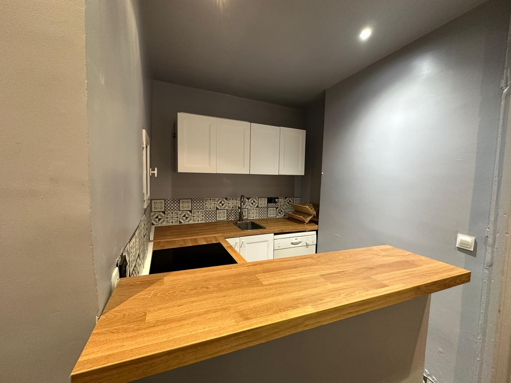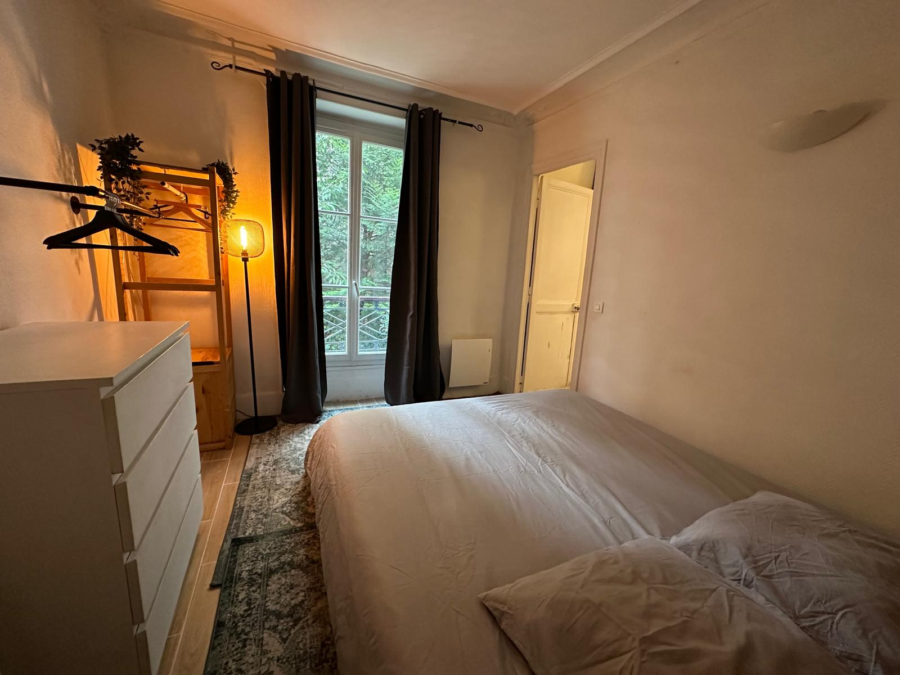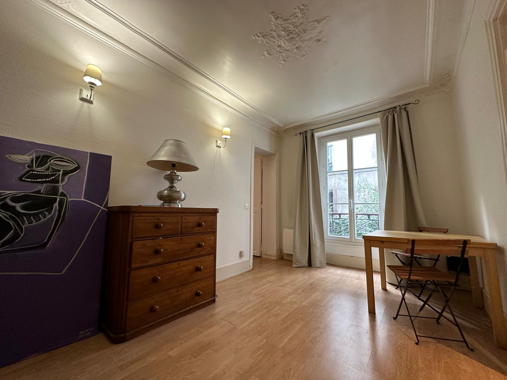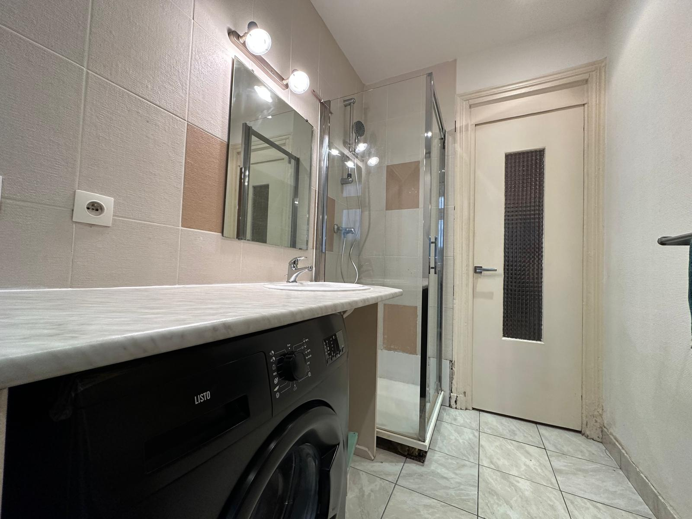

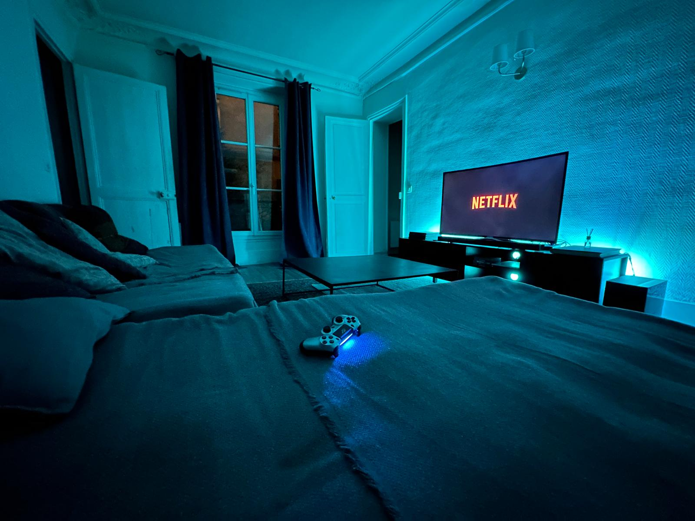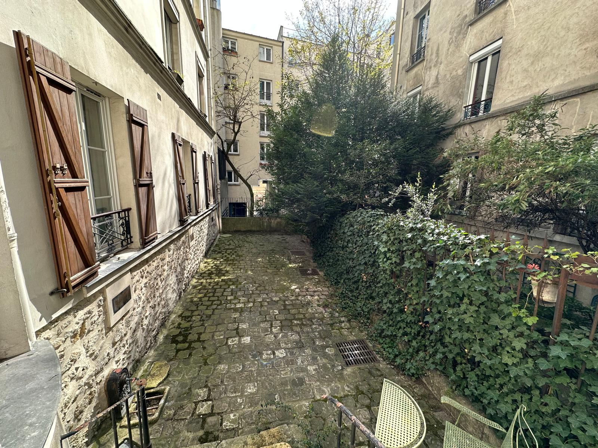
